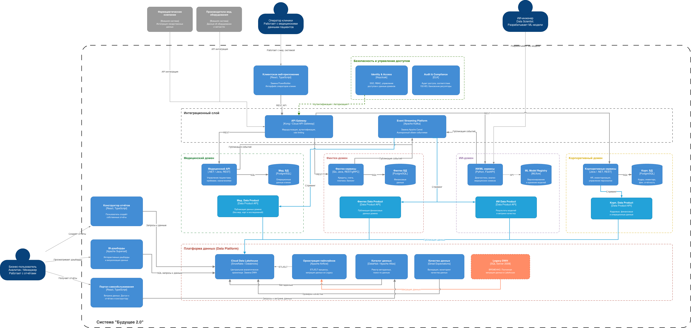
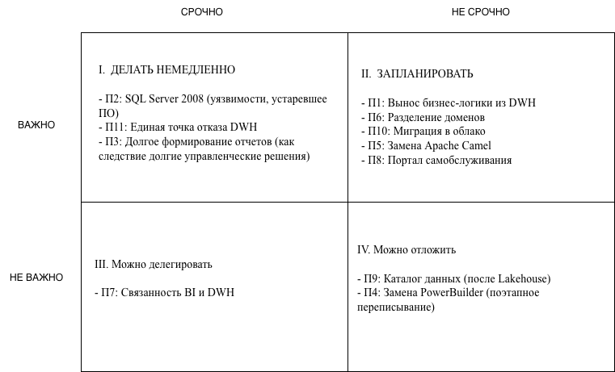

# Задание 1. Проектирование целевой архитектуры и приоритизация проблем для поддержки ключевых бизнес-сценариев компании

## Описание целевой архитектуры

### Архитектурный подход

Целевая архитектура строится на принципах **Data Mesh**, где каждый бизнес-домен владеет своими данными и публикует их в виде **Data Products**. Центральная платформа данных предоставляет инфраструктуру (Lakehouse, каталог, качество данных), но не содержит бизнес-логику.

### Выделенные домены:

| Домен                | Ответственность                                  | Ключевые технологии                    |
| -------------------- | ------------------------------------------------ | -------------------------------------- |
| **Медицинский**      | Пациенты, приёмы, назначения, клинические данные | .NET/Java, PostgreSQL                  |
| **Финтех**           | Кредиты, счета, платежи, банкинг                 | Go, Java, PostgreSQL                   |
| **ИИ**               | ML-модели, диагностика, анализ снимков           | Python, FastAPI, MLflow                |
| **Корпоративный**    | HR, инвентаризация, фин. отчётность              | Java/.NET, PostgreSQL                  |
| **Платформа данных** | Lakehouse, пайплайны, каталог, качество данных   | Snowflake/Databricks, Airflow, DataHub |

### Как архитектура поддерживает ключевые бизнес-сценарии:

1. **Быстрая подготовка отчётности**: Замена монолитного DWH на Cloud Data Lakehouse (Snowflake/Databricks) с колоночным хранением и MPP-вычислениями. Формирование отчётов - минуты вместо часов.

2. **Независимое развитие направлений**: Каждый домен имеет собственные сервисы, БД и Data Products. Команды деплоят независимо. Интеграция через Event Streaming (Kafka) и API Gateway.

3. **Масштабирование для новых бизнесов**: Новое направление (фарма, электроника) подключается как отдельный домен с собственным Data Product. Не требуется менять центральную платформу.

4. **Интеграция фармкомпаний и производителей электроники**: Внешние системы подключаются через API Gateway. Стандартизированный интерфейс позволяет подключить новых партнёров без переработки существующей архитектуры.

5. **Портал самообслуживания**: Бизнес-пользователь работает через единый портал, где может находить данные через каталог, строить собственные отчёты и просматривать дэшборды - всё в рамках своего уровня доступа.

6. **Безопасность и compliance**: Централизованное управление доступом, аудит, разграничение данных по доменам. Медицинские карты и исследования не попадают в витрину данных.

---

## Проблемные места (AS-IS)

| #       | Проблема                                          | Описание                                                                                                                                                          | Затронутые бизнес-сценарии                                      | Бизнес-влияние                                                                                                   |
| ------- | ------------------------------------------------- | ----------------------------------------------------------------------------------------------------------------------------------------------------------------- | --------------------------------------------------------------- | ---------------------------------------------------------------------------------------------------------------- |
| **П1**  | **Монолитный DWH с бизнес-логикой**               | Значительная часть бизнес-логики реализована в DWH на SQL Server 2008. Любое изменение требует координации между всеми командами.                                 | Независимое развитие доменов, time-to-market для новых фич      | **Критическое**: блокирует автономность команд, замедляет вывод продуктов на рынок                               |
| **П2**  | **Устаревший SQL Server 2008**                    | Версия 2008 года не поддерживается Microsoft с 2019 года. Отсутствуют патчи безопасности, нет поддержки современных функций (колоночные индексы, In-Memory OLTP). | Производительность отчётности, безопасность данных              | **Критическое**: уязвимости безопасности в системе с медицинскими и финансовыми данными                          |
| **П3**  | **Формирование отчётов занимает часы**            | Сотни терабайт данных, множество трансформаций, row-based storage. Сложные отчёты строятся часами.                                                                | Быстрая подготовка отчётности, управленческие решения           | **Высокое**: задержки в принятии управленческих решений, снижение операционной эффективности                     |
| **П4**  | **PowerBuilder - устаревший клиент**              | PowerBuilder - технология 1990-х. Крайне сложно найти разработчиков, невозможно интегрировать с современными системами (SSO, мобильные устройства).               | Работа операторов клиник, UX сотрудников                        | **Среднее**: риск потери кадровой экспертизы, низкая производительность операторов                               |
| **П5**  | **Apache Camel как шина данных**                  | Шина на Apache Camel выполняет роль point-to-point интеграции. При росте числа доменов и сервисов количество соединений растёт квадратично.                       | Масштабирование, интеграция новых направлений                   | **Высокое**: каждая новая интеграция увеличивает сложность, замедляет подключение партнёров                      |
| **П6**  | **Отсутствие разделения доменов**                 | Все данные лежат в одном DWH. Нет чётких границ между медицинскими, финансовыми и корпоративными данными. Нет владельцев данных.                                  | Безопасность, compliance, автономность команд                   | **Критическое**: нарушение принципа минимальных привилегий, риски с регуляторами (152-ФЗ, банковские требования) |
| **П7**  | **Тесная связанность BI и DWH**                   | Power BI с большим количеством кастомизаций напрямую зависит от структуры DWH. Изменение схемы DWH ломает отчёты.                                                 | Стабильность отчётности, развитие платформы данных              | **Среднее**: хрупкость аналитической системы, боязнь изменений в DWH                                             |
| **П8**  | **Нет самообслуживания для бизнес-пользователей** | Бизнес-пользователи не могут самостоятельно строить отчёты. Каждый новый отчёт - задача для BI-команды.                                                           | Оперативность аналитики, нагрузка на BI-команду                 | **Высокое**: bottleneck на BI-команде, задержки в получении данных для принятия решений                          |
| **П9**  | **Нет каталога данных**                           | Бизнес-пользователи не знают, какие данные доступны, где они лежат и кому принадлежат.                                                                            | Обнаружение данных, самообслуживание                            | **Среднее**: дублирование запросов, потеря времени на поиск данных                                               |
| **П10** | **Отсутствие облачной инфраструктуры**            | Вся инфраструктура on-premise. Масштабирование требует закупки оборудования (недели/месяцы).                                                                      | Масштабирование, отказоустойчивость, подключение новых бизнесов | **Высокое**: невозможность быстро масштабировать ресурсы под растущие нагрузки                                   |
| **П11** | **Единая точка отказа - DWH**                     | DWH является центральным узлом для всех процессов. Его недоступность парализует всю компанию.                                                                     | Доступность сервисов, непрерывность бизнеса                     | **Критическое**: простой DWH = простой всего бизнеса                                                             |

---

## Приоритизация проблем

### Метод MoSCoW

| Категория                   | Проблемы                                 | Обоснование                                                                                                                  |
| --------------------------- | ---------------------------------------- | ---------------------------------------------------------------------------------------------------------------------------- |
| **Must Have** (обязательно) | **П1** - Вынос бизнес-логики из DWH      | Без этого невозможно развивать домены независимо - основная цель трансформации                                               |
|                             | **П6** - Разделение доменов              | Регуляторные требования: медицинские данные (152-ФЗ) и банковские данные должны быть изолированы. Блокирует любые интеграции |
|                             | **П2** - Миграция с SQL Server 2008      | Неподдерживаемая версия с уязвимостями безопасности - недопустимо для мед. и фин. данных                                     |
|                             | **П11** - Устранение единой точки отказа | Падение DWH парализует весь бизнес, что критично для компании с банковской лицензией                                         |
| **Should Have** (нужно)     | **П3** - Ускорение формирования отчётов  | Прямо влияет на скорость принятия управленческих решений и выручку                                                           |
|                             | **П5** - Замена Apache Camel на Kafka    | Необходимо для масштабирования интеграций при подключении фарм. и электроники                                                |
|                             | **П8** - Портал самообслуживания         | Ключевая бизнес-задача от руководства, напрямую запрошена                                                                    |
|                             | **П10** - Миграция в облако              | Стратегическое решение руководства, обеспечивает масштабирование                                                             |
| **Could Have** (желательно) | **П4** - Замена PowerBuilder             | Операторы продолжают работать, хотя с неудобствами. Можно заменить поэтапно                                                  |
|                             | **П9** - Каталог данных                  | Повышает эффективность работы с данными, но не блокирует основные процессы                                                   |
|                             | **П7** - Снижение связанности BI и DWH   | Решится естественным образом при переходе на Lakehouse                                                                       |
| **Won't Have** (не сейчас)  | -                                        | Нет проблем, которые можно полностью проигнорировать                                                                         |

### Матрица Эйзенхауэра

### Связь с целями бизнеса

| Цель бизнеса                         | Критичные проблемы | Влияние на бизнес                                                                                                                |
| ------------------------------------ | ------------------ | -------------------------------------------------------------------------------------------------------------------------------- |
| **Выручка и рост**                   | П3, П8             | Задержки в отчётности -> медленные решения -> упущенная выручка. Без портала аналитики не могут оперативно оценить эффективность |
| **Time-to-market**                   | П1, П5, П6, П10    | Монолитный DWH и legacy-интеграция тормозят запуск новых продуктов. Каждое изменение требует координации всех команд             |
| **Качество мед. сервисов**           | П2, П11            | Устаревшая платформа - риск сбоев. ИИ-диагностика зависит от доступности DWH. Недоступность = невозможность поставить диагноз    |
| **Качество фин. сервисов**           | П2, П6             | Банковская лицензия требует аудита и изоляции данных. SQL Server 2008 не соответствует требованиям безопасности                  |
| **Масштабирование на новые бизнесы** | П1, П5, П6, П10    | Интеграция фарм. компаний и производителей электроники невозможна без разделения доменов и современной интеграционной шины       |
| **Регуляторные требования**          | П2, П6             | 152-ФЗ (персональные данные), банковские регуляторы (ЦБ РФ) - требуют изоляции и аудита данных                                   |

---

## Рекомендуемый порядок реализации

### Фаза 1 (месяцы 1–3): Фундамент

1. **Определение границ доменов** (П6) - выделение ответственных, описание контрактов между доменами
2. **Начало миграции в облако** (П10) - развёртывание Data Lakehouse, базовая инфраструктура
3. **Развёртывание Kafka** (П5) - параллельно с Apache Camel, постепенная миграция интеграций
4. **Безопасность** - настройка централизованного управления доступом

### Фаза 2 (месяцы 3–6): Миграция данных

5. **Поэтапная миграция из DWH** (П1, П2) - домен за доменом, начиная с финтеха (банковские регуляторы)
6. **Создание Data Products** - каждый домен публикует данные в Lakehouse
7. **MVP портала самообслуживания** (П8) - базовый доступ к дэшбордам и конструктору отчётов
8. **Устранение единой точки отказа** (П11) - репликация, отказоустойчивость Lakehouse

### Фаза 3 (месяцы 6–12): Развитие

9. **Полноценный портал самообслуживания** (П8) - конструктор отчётов, каталог данных (П9)
10. **Замена PowerBuilder** (П4) - современное веб-приложение для операторов
11. **Подключение внешних партнёров** - фармкомпании и производители электроники через API Gateway
12. **Завершение миграции из Legacy DWH** (П2) - финальный вывод SQL Server 2008 из эксплуатации

---

## Обоснование отказа от legacy-систем

| Legacy-система                  | Рекомендация                                             | Обоснование                                                                                |
| ------------------------------- | -------------------------------------------------------- | ------------------------------------------------------------------------------------------ |
| **SQL Server 2008 (DWH)**       | **Заменить** на Cloud Data Lakehouse                     | Не поддерживается, уязвимости безопасности, не масштабируется, невозможно разделить домены |
| **PowerBuilder**                | **Заменить** на современное веб-приложение (React)       | Невозможно найти разработчиков, не поддерживает SSO/мобильные, тормозит UX                 |
| **Apache Camel**                | **Заменить** на Apache Kafka                             | Point-to-point интеграция не масштабируется при росте доменов, нет replay событий          |
| **Power BI (с кастомизациями)** | **Заменить** на Apache Superset / встроенный BI в портал | Тесная связанность с DWH, невозможность self-service без BI-команды                        |
