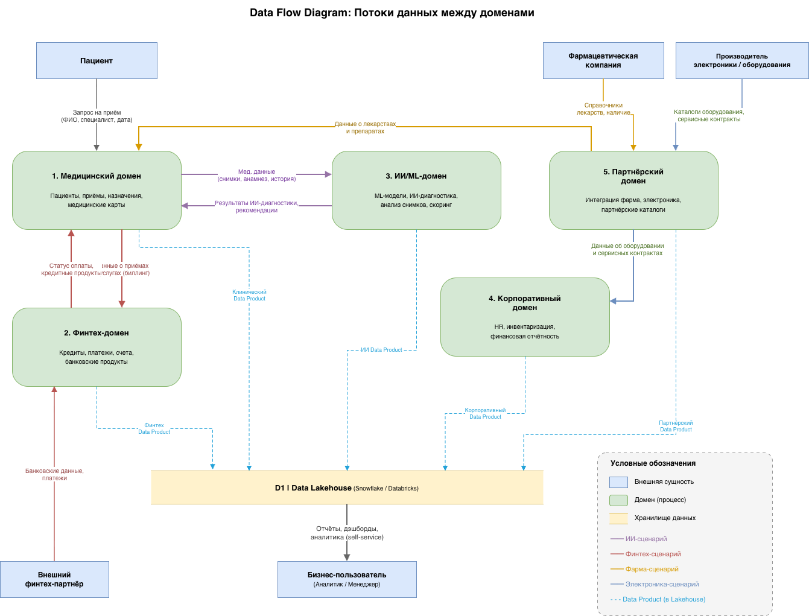
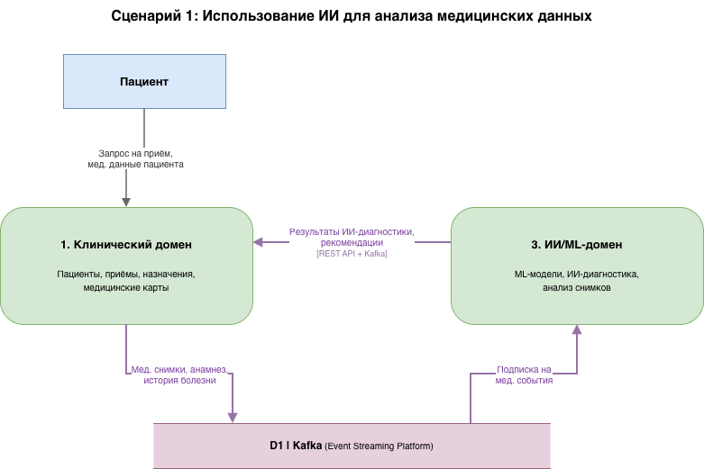
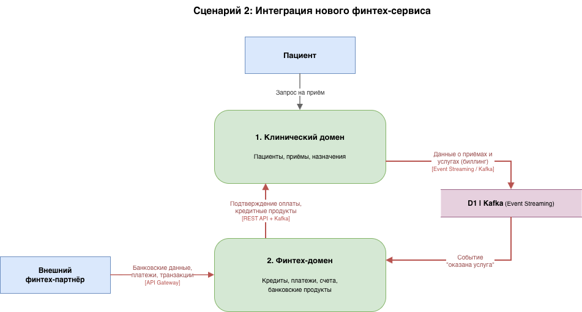
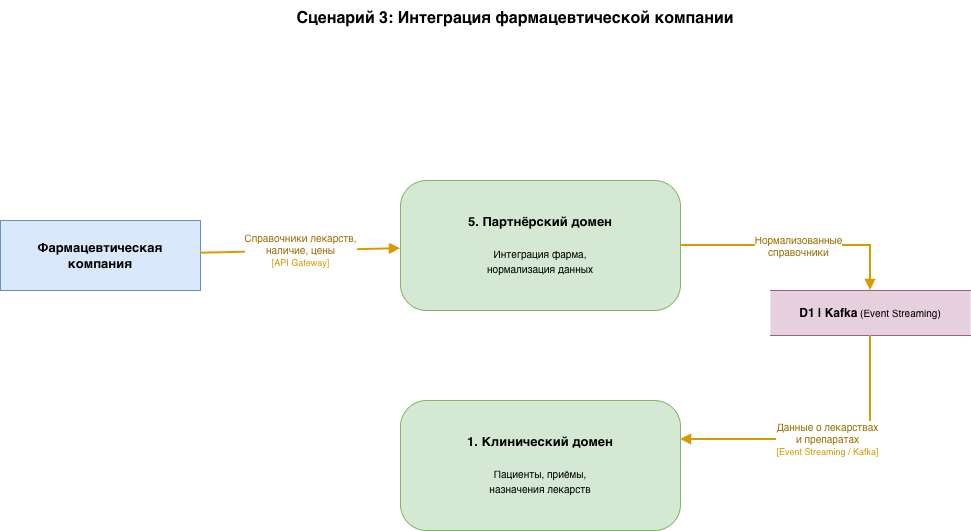
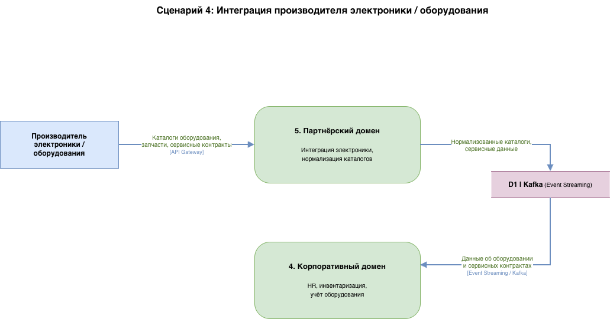
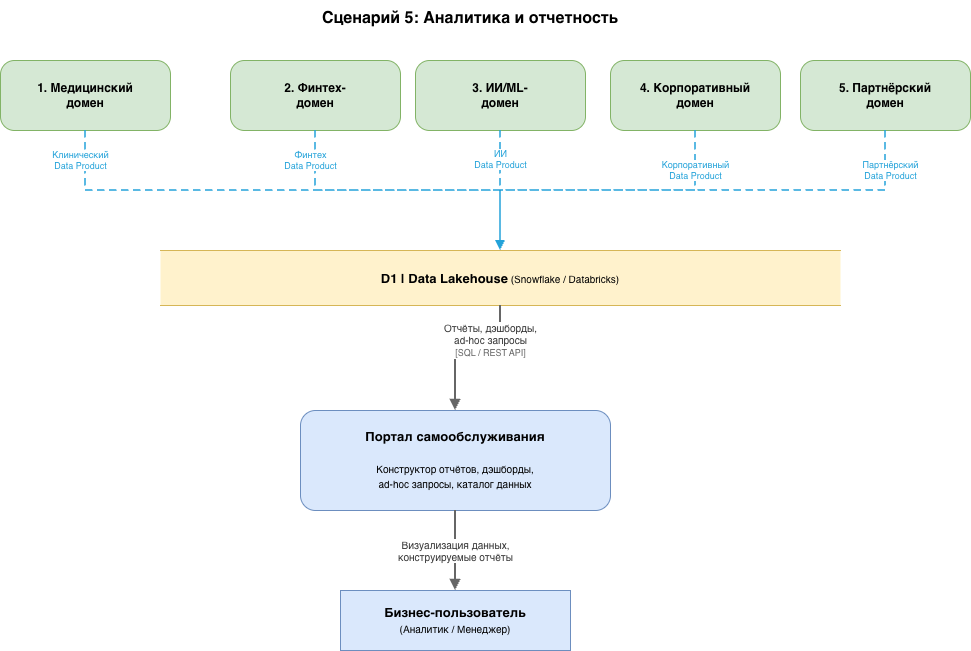

# Задание 2. Разделение системы на домены и моделирование потоков данных

## DFD-диаграмма потоков данных

---

## Выделенные домены

Система разделена на **5 бизнес-доменов**, каждый из которых соответствует отдельному бизнес-направлению и может развиваться независимо. Разделение основано на принципах **Domain-Driven Design (DDD)** и **Data Mesh**: каждый домен владеет своими данными, публикует Data Products и имеет четкие контракты с другими доменами.

| #   | Домен             | Bounded Context                                                                             | Владелец                 | Ключевые данные                                                        |
| --- | ----------------- | ------------------------------------------------------------------------------------------- | ------------------------ | ---------------------------------------------------------------------- |
| 1   | **Медицинский**   | Пациенты, приемы, назначения, медицинские карты, клинические протоколы                      | Медицинская команда      | Записи пациентов, история приемов, назначения, результаты исследований |
| 2   | **Финтех**        | Кредиты, платежи, счета, банковские продукты, страхование                                   | Финансовая команда       | Транзакции, кредитные заявки, счета, платежные данные                  |
| 3   | **ИИ/ML**         | ML-модели, ИИ-диагностика, анализ снимков, предиктивная аналитика, скоринг                  | Data Science команда     | Модели, результаты предсказаний, метрики качества, датасеты            |
| 4   | **Корпоративный** | HR, управление персоналом, инвентаризация, финансовая отчетность                            | Административная команда | Кадровые данные, инвентарь оборудования, внутренняя отчетность         |
| 5   | **Партнерский**   | Интеграция с фармкомпаниями, производителями электроники/оборудования, партнерские каталоги | Команда интеграций       | Справочники лекарств, каталоги оборудования, партнерские контракты     |

---

## Обоснование разделения на домены

### 1. Медицинский домен

**Почему отдельный домен:**

- **Регуляторные требования**: Медицинские данные пациентов подпадают под 152-ФЗ (персональные данные) и отраслевые регуляции. Изоляция данных - обязательное требование
- **Специфичная бизнес-логика**: Медицинские workflow (прием -> диагностика -> назначение -> контроль) принципиально отличаются от финансовых или корпоративных процессов
- **Отдельный темп развития**: Медицинские протоколы и стандарты обновляются по своему графику, независимо от финтех-продуктов

**Поддерживаемые сценарии**: Запись пациентов, ведение медкарт, назначения, взаимодействие с ИИ-диагностикой, получение данных о лекарствах от партнеров

### 2. Финтех-домен

**Почему отдельный домен:**

- **Банковская лицензия**: Требования ЦБ РФ к изоляции финансовых данных, аудиту транзакций и отчетности. Финансовые данные не должны смешиваться с медицинскими
- **Быстрый цикл разработки**: Финтех-продукты (кредиты, страховки, платежные сервисы) требуют частых релизов и A/B-тестирования
- **Масштабируемость**: Подключение новых финтех-сервисов и партнеров не должно затрагивать медицинский или корпоративный домен

**Поддерживаемые сценарии**: Оплата медицинских услуг, кредитование пациентов, интеграция с внешними банковскими системами, расчет стоимости лечения

### 3. ИИ/ML-домен

**Почему отдельный домен:**

- **Другой технологический стек**: Python, GPU-кластеры, MLflow - фундаментально отличается от .NET/Java стека клинических и финтех-сервисов
- **Экспериментальный цикл**: ML-модели проходят циклы обучения, A/B-тестирования и постепенного внедрения. Этот цикл не должен быть связан с релизным циклом других доменов
- **Горизонтальное применение**: ИИ-модели используются несколькими доменами (диагностика для клиники, скоринг для финтеха). Выделение в отдельный домен позволяет обслуживать всех потребителей

**Поддерживаемые сценарии**: ИИ-диагностика по медицинским снимкам, анализ анамнеза пациента, кредитный скоринг, предиктивная аналитика

### 4. Корпоративный домен

**Почему отдельный домен:**

- **Внутренние процессы**: HR, инвентаризация и внутренняя отчетность - это back-office функции с медленным темпом изменений
- **Отдельные стейкхолдеры**: Административный и HR-персонал работает с совершенно другими данными и процессами, чем врачи или финансисты
- **Стабильность**: Корпоративные процессы не должны быть затронуты при изменениях в клинических или финтех-сервисах

**Поддерживаемые сценарии**: Управление кадрами, учет медицинского оборудования (включая данные от партнеров-производителей), внутренняя финансовая отчетность

### 5. Партнерский домен

**Почему отдельный домен:**

- **Изоляция внешних зависимостей**: Внешние системы фармкомпаний и производителей электроники имеют свои форматы данных, протоколы и SLA. Партнерский домен инкапсулирует эту сложность
- **Стандартизированный API для новых партнеров**: Новый партнер (фарма, электроника, любая будущая вертикаль) подключается через партнерский домен без изменения внутренних доменов
- **Decoupling**: Клинический домен получает данные о лекарствах через стандартный контракт. При смене фармацевтического поставщика изменения затрагивают только партнерский домен

**Поддерживаемые сценарии**: Интеграция фармкомпаний (справочники лекарств, наличие), интеграция производителей электроники (каталоги, сервисные контракты), подключение будущих партнеров

---

## Потоки данных между доменами

### Ключевые бизнес-сценарии и обеспечивающие их потоки данных

#### Сценарий 1: Использование ИИ для анализа медицинских данных

| Поток         | Источник    | Приемник    | Данные                             | Механизм                |
| ------------- | ----------- | ----------- | ---------------------------------- | ----------------------- |
| Мед. данные   | Клинический | ИИ/ML       | Снимки, анамнез, история болезни   | Event Streaming (Kafka) |
| Результаты ИИ | ИИ/ML       | Клинический | Диагноз, вероятность, рекомендации | REST API + Kafka        |

**Как это работает без DWH**: Клинический домен публикует события о новых медицинских данных в Kafka. ИИ-домен подписывается на эти события, обрабатывает данные ML-моделями и возвращает результаты напрямую в клинический домен. DWH не участвует в операционном потоке - данные идут domain-to-domain.

#### Сценарий 2: Интеграция нового финтех-сервиса

| Поток             | Источник        | Приемник    | Данные                                   | Механизм                |
| ----------------- | --------------- | ----------- | ---------------------------------------- | ----------------------- |
| Биллинг           | Клинический     | Финтех      | Данные о приемах и услугах               | Event Streaming (Kafka) |
| Статус оплаты     | Финтех          | Клинический | Подтверждение оплаты, кредитные продукты | REST API + Kafka        |
| Банковские данные | Внешний партнер | Финтех      | Платежи, банковские транзакции           | API Gateway             |

**Как это работает без DWH**: Клинический домен публикует событие «оказана услуга» в Kafka. Финтех-домен получает событие, формирует счет и обрабатывает оплату. Подключение нового финтех-партнера - это добавление адаптера в Финтех-домен через API Gateway. Ни DWH, ни другие домены не затрагиваются.

#### Сценарий 3: Интеграция фармацевтической компании

| Поток               | Источник     | Приемник    | Данные                      | Механизм                |
| ------------------- | ------------ | ----------- | --------------------------- | ----------------------- |
| Справочники         | Фармкомпания | Партнерский | Лекарства, наличие, цены    | API Gateway             |
| Данные о лекарствах | Партнерский  | Клинический | Нормализованные справочники | Event Streaming (Kafka) |

**Как это работает без DWH**: Фармкомпания интегрируется через API Gateway в партнерский домен. Партнерский домен нормализует данные в единый формат и публикует их в Kafka. Клинический домен подписывается и получает актуальные справочники. При подключении новой фармкомпании изменения только в партнерском домене.

#### Сценарий 4: Интеграция производителя электроники / оборудования

| Поток                  | Источник      | Приемник      | Данные                                     | Механизм                |
| ---------------------- | ------------- | ------------- | ------------------------------------------ | ----------------------- |
| Каталоги               | Производитель | Партнерский   | Оборудование, запчасти, контракты          | API Gateway             |
| Данные об оборудовании | Партнерский   | Корпоративный | Нормализованные каталоги, сервисные данные | Event Streaming (Kafka) |

**Как это работает без DWH**: Аналогично фарма-сценарию. Партнерский домен выступает единой точкой интеграции для всех внешних партнеров, изолируя внутренние домены от внешних изменений.

#### Сценарий 5: Аналитика и отчетность

| Поток         | Источник       | Приемник            | Данные                              | Механизм                |
| ------------- | -------------- | ------------------- | ----------------------------------- | ----------------------- |
| Data Products | Каждый домен   | Data Lakehouse      | Агрегированные, обезличенные данные | Data Product API        |
| Аналитика     | Data Lakehouse | Бизнес-пользователь | Отчеты, дэшборды, ad-hoc запросы    | Портал самообслуживания |

**Как это работает без DWH**: Каждый домен самостоятельно публикует Data Products - подготовленные наборы данных с описанием, SLA и контрактом качества. Data Lakehouse (Snowflake/Databricks) агрегирует Data Products для кросс-доменной аналитики. Бизнес-логика остается в доменах, Lakehouse - чистая аналитическая инфраструктура.

---

## Преимущества разделения на домены для бизнеса

### Ускорение вывода продуктов (Time-to-Market)

| Аспект              | AS-IS (монолитный DWH)                                      | TO-BE (домены)                                              |
| ------------------- | ----------------------------------------------------------- | ----------------------------------------------------------- |
| Новый финтех-сервис | Изменения в DWH -> координация всех команд -> недели/месяцы | Изменения только в финтех-домене -> дни                     |
| Новая ИИ-модель     | Зависимость от DWH для данных -> сложная интеграция         | ИИ-домен потребляет события напрямую из клинического домена |
| Новый партнер       | Изменения в DWH + шине + всех зависимых системах            | Добавление адаптера в партнерский домен                     |

Каждый домен имеет свой CI/CD-пайплайн и деплоится независимо. Финтех-команда может выпускать новый продукт, не дожидаясь релиза медицинского домена.

### Снижение зависимости от DWH

| Аспект                | AS-IS                                           | TO-BE                                                |
| --------------------- | ----------------------------------------------- | ---------------------------------------------------- |
| Бизнес-логика         | Реализована в DWH (SQL Server 2008)             | В доменных сервисах                                  |
| DWH как bottleneck    | Любое изменение требует координации всех команд | Домены общаются напрямую через Kafka/API             |
| Единая точка отказа   | Падение DWH парализует весь бизнес              | Падение одного домена не затрагивает остальные       |
| Роль хранилища данных | DWH = бизнес-логика + хранение + интеграция     | Data Lakehouse = только аналитика, без бизнес-логики |

### Возможность отдельного развития направлений

| Направление       | Автономность                                                         | Пример                                                      |
| ----------------- | -------------------------------------------------------------------- | ----------------------------------------------------------- |
| **Клиника**       | Медицинская команда развивает протоколы, не затрагивая финансы       | Новый тип приема -> изменения только в клиническом домене   |
| **Финтех**        | Финансовая команда запускает продукты с частотой финтех-стартапа     | Новый кредитный продукт -> изменения только в финтех-домене |
| **ИИ**            | Data Science экспериментирует с моделями без влияния на прод-системы | Новая модель диагностики -> A/B-тест в ИИ-домене            |
| **Партнеры**      | Подключение новых вертикалей без переработки ядра системы            | Новая фармкомпания -> адаптер в партнерском домене          |
| **Корпоративный** | Back-office развивается в своем темпе                                | Новая HR-система -> изменения только в корпоративном домене |

### Масштабируемость для будущих бизнесов

Архитектура с выделенными доменами позволяет подключать новые бизнес-вертикали без изменения существующих:

- **Новая фармкомпания**: подключается через партнерский домен (новый адаптер), данные автоматически доступны клиническому домену
- **Новый производитель электроники**: аналогично, через партнерский домен -> корпоративный домен
- **Новый финтех-партнер**: подключается через API Gateway в финтех-домен
- **Новое бизнес-направление** (например, телемедицина): создается как новый домен с собственными сервисами и Data Products, интегрируется через Kafka без изменения существующих доменов

### Compliance и безопасность

- Медицинские данные изолированы в клиническом домене (152-ФЗ)
- Финансовые данные изолированы в финтех-домене (требования ЦБ РФ)
- Data Products публикуют только обезличенные и агрегированные данные
- Каждый домен имеет собственные политики доступа и аудита
