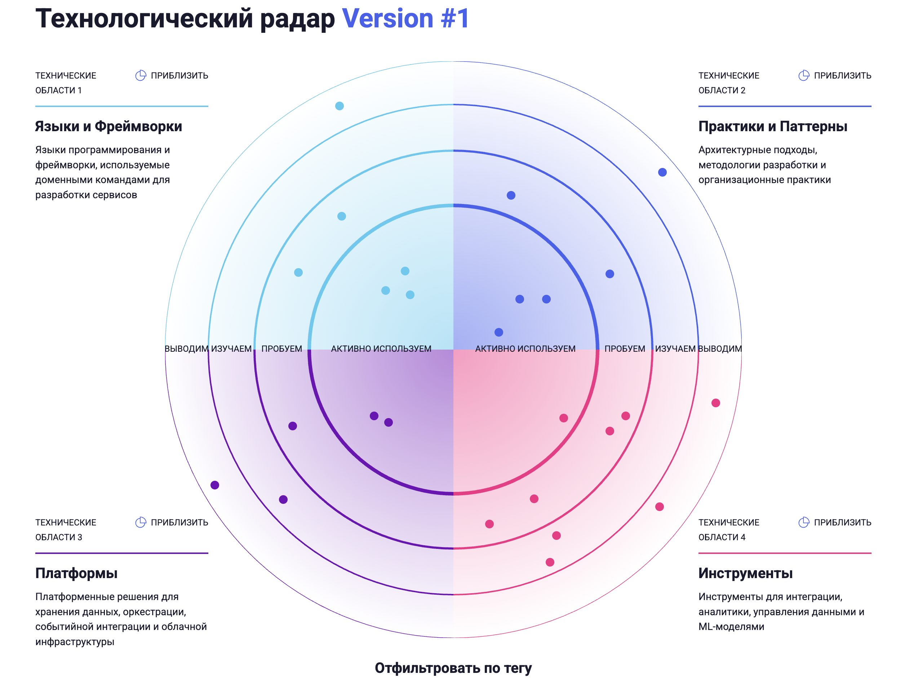

# Задание 3. Технологический радар и роадмап изменений

## 1. Технологический радар



Технологический радар реализован как Node.js-приложение на базе [AOE Technology Radar](https://github.com/AOEpeople/aoe_technology_radar) v4.

### Запуск

```bash
cd task3/tech-radar
npm install
npm run build    # сборка статического сайта в ./build
npm run serve    # запуск dev-сервера
```

### Кольца

| Кольцо                 | Значение                                                                                     |
| ---------------------- | -------------------------------------------------------------------------------------------- |
| **Активно используем** | Технология проверена и рекомендуется к активному внедрению. Критична для целевой архитектуры |
| **Пробуем**            | Высокий потенциал, рекомендуется пилотный проект для оценки применимости                     |
| **Изучаем**            | Перспективная технология на этапе исследования. Требует proof-of-concept                     |
| **Выводим**            | Legacy или устаревшая технология. Рекомендуется к замене или выводу из эксплуатации          |

## 2. Роадмап изменений


Роадмап рассчитан на 12 месяцев (4 квартала) и распределён по 4 командам. Каждый этап привязан к бизнес-целям компании.

### Команды и ресурсы

| Команда                          | Численность | Зона ответственности                                                                     |
| -------------------------------- | ----------- | ---------------------------------------------------------------------------------------- |
| **Инфраструктурная команда**     | 7 чел.      | Облачная инфраструктура, Kubernetes, безопасность, мониторинг, Data Lakehouse            |
| **Платформенная команда данных** | 5 чел.      | Data Products, миграция данных, каталог данных, качество данных, портал самообслуживания |
| **Команда интеграций**           | 3 чел.      | Apache Kafka, API Gateway, подключение партнёров, миграция с Apache Camel                |
| **Продуктовые команды доменов**  | 30 чел.     | Доменные сервисы (мед., финтех, ИИ, корп.), разделение на домены, продуктовый бэклог     |

### Q1: Фундамент (месяцы 1–3)

| Команда          | Активность                                                             | Ожидаемый результат                                   | Бизнес-цель                         |
| ---------------- | ---------------------------------------------------------------------- | ----------------------------------------------------- | ----------------------------------- |
| Инфраструктурная | Развёртывание облачной инфраструктуры (Kubernetes, сеть, безопасность) | Готовая облачная платформа для развёртывания сервисов | Масштабирование, отказоустойчивость |
| Платформенная    | Проектирование Data Products и границ доменов                          | Документация контрактов между доменами, модель данных | Независимое развитие доменов        |
| Интеграции       | Развёртывание Apache Kafka                                             | Работающий кластер Kafka, базовые топики              | Масштабируемая интеграция           |
| Интеграции       | Миграция с Apache Camel на Kafka (начало)                              | 30% интеграций переведены на Kafka                    | Устранение bottleneck интеграции    |
| Продуктовые      | Продуктовый техдолг                                                    | Критичные зависимости от DWH устранены                | Подготовка к миграции               |
| Продуктовые      | Разделение сервисов по доменам                                         | Сервисы каждого домена изолированы, CI/CD настроен    | Автономность команд                 |

### Q2: Миграция (месяцы 4–6)

| Команда          | Активность                                                 | Ожидаемый результат                                             | Бизнес-цель                       |
| ---------------- | ---------------------------------------------------------- | --------------------------------------------------------------- | --------------------------------- |
| Инфраструктурная | Развёртывание Data Lakehouse (Snowflake/Databricks)        | Работающий Lakehouse, подключённый к облаку                     | Быстрая отчётность                |
| Платформенная    | Поэтапная миграция данных из DWH (начиная с финтех-домена) | Финтех-данные в Lakehouse, первые Data Products                 | Compliance ЦБ РФ, изоляция данных |
| Платформенная    | Развёртывание DataHub (каталог данных)                     | Каталог с описанием 50%+ данных                                 | Обнаружение данных                |
| Интеграции       | Внедрение API Gateway (начало)                             | Базовый API Gateway, первые партнёрские эндпоинты               | Интеграция партнёров              |
| Интеграции       | Миграция с Apache Camel на Kafka (завершение)              | 100% интеграций переведены на Kafka                             | Масштабируемая интеграция         |
| Продуктовые      | MVP портала самообслуживания                               | Бизнес-пользователи видят дэшборды, базовый конструктор отчётов | Оперативность аналитики           |
| Продуктовые      | Продуктовый бэклог                                         | Новые функции для клиник и финтех-продуктов                     | Выручка и рост                    |

### Q3: Развитие (месяцы 7–9)

| Команда          | Активность                                 | Ожидаемый результат                                        | Бизнес-цель                   |
| ---------------- | ------------------------------------------ | ---------------------------------------------------------- | ----------------------------- |
| Инфраструктурная | Настройка отказоустойчивости               | Репликация, автоматический failover, SLA 99.9%             | Качество мед. и фин. сервисов |
| Инфраструктурная | Развёртывание Data Lakehouse (продолжение) | Lakehouse обрабатывает 100% аналитических запросов         | Быстрая отчётность            |
| Платформенная    | Миграция мед. и корп. доменов из DWH       | Все домены мигрированы, DWH разгружен                      | Независимое развитие          |
| Платформенная    | Портал самообслуживания (полноценный)      | Конструктор отчётов, доступ к каталогу, разграничение прав | Самообслуживание аналитики    |
| Интеграции       | Внедрение API Gateway (завершение)         | Стандартизированный API для всех партнёрских интеграций    | Масштабирование партнёров     |
| Интеграции       | Подключение фармкомпаний                   | Фармкомпании интегрированы, справочники лекарств актуальны | Качество мед. сервисов        |
| Продуктовые      | Мед. и корп. домены: Data Products         | Каждый домен публикует Data Products в Lakehouse           | Кросс-доменная аналитика      |
| Продуктовые      | Продуктовый бэклог                         | Новые продукты, расширение функциональности                | Выручка и рост                |

### Q4: Стабилизация и масштабирование (месяцы 10–12)

| Команда          | Активность                             | Ожидаемый результат                                    | Бизнес-цель                      |
| ---------------- | -------------------------------------- | ------------------------------------------------------ | -------------------------------- |
| Инфраструктурная | Вывод SQL Server 2008 и стабилизация   | Legacy DWH полностью выведен из эксплуатации           | Безопасность, снижение затрат    |
| Платформенная    | Data Quality и оптимизация Lakehouse   | Great Expectations настроен, SLA данных определены     | Качество данных, compliance      |
| Платформенная    | Портал самообслуживания (развитие)     | Ad-hoc запросы, расширенная визуализация, self-service | Скорость принятия решений        |
| Интеграции       | Подключение производителей электроники | Каталоги оборудования интегрированы через API Gateway  | Масштабирование на новые бизнесы |
| Интеграции       | Подключение новых партнёров            | Стандартизированный процесс onboarding партнёров       | Масштабирование                  |
| Продуктовые      | Замена PowerBuilder на React           | Современное веб-приложение для операторов клиник       | UX, производительность персонала |
| Продуктовые      | Продуктовый бэклог                     | Новые бизнес-направления, расширение рынка             | Выручка и рост                   |

---

## 3. Обоснование планируемых изменений

### Q1: Фундамент - зачем нужен этот этап

**Развёртывание облачной инфраструктуры и Kubernetes:**

- **Масштабирование**: текущая on-premise инфраструктура не позволяет быстро масштабировать ресурсы. Закупка оборудования занимает недели/месяцы. Облако даёт масштабирование за минуты
- **Снижение затрат**: оплата по потреблению вместо капитальных затрат на оборудование. При пиковых нагрузках (конец квартала, массовая отчётность) ресурсы масштабируются автоматически
- **Отказоустойчивость**: Kubernetes обеспечивает автоматический restart, self-healing, rolling updates - критично для мед. и фин. сервисов с требованиями 24/7

**Проектирование Data Products и границ доменов:**

- **Скорость принятия решений**: без чётких границ доменов невозможно параллельное развитие. Каждое изменение в DWH требует координации всех команд (недели) -> с доменами - дни
- **Compliance**: медицинские данные (152-ФЗ) и банковские данные (ЦБ РФ) должны быть изолированы. Это обязательное требование регуляторов, нарушение грозит отзывом лицензии

**Развёртывание Apache Kafka и миграция с Apache Camel:**

- **Масштабирование**: Apache Camel - point-to-point интеграция. При N доменах требуется O(N²) соединений. Kafka - pub/sub модель с O(N) соединениями
- **Надёжность**: Kafka гарантирует доставку сообщений и поддерживает replay событий. Apache Camel теряет сообщения при сбоях
- **Интеграция партнёров**: подключение фармкомпаний и производителей электроники требует масштабируемой шины событий

**Продуктовый техдолг и разделение на домены:**

- **Time-to-market**: монолитный DWH - bottleneck для всех продуктовых команд. Финтех-команда не может выпустить новый кредитный продукт, не дожидаясь релиза медицинского домена
- **Автономность**: разделение на домены позволяет каждой команде деплоить независимо. Финтех деплоит 10 раз в день, медицинский домен - раз в неделю. Это разные циклы разработки

---

### Q2: Миграция - зачем нужен этот этап

**Развёртывание Data Lakehouse (Snowflake/Databricks):**

- **Скорость отчётности**: текущий DWH строит сложные отчёты часами. Lakehouse с колоночным хранением и MPP-вычислениями - за минуты. Это прямо влияет на скорость принятия управленческих решений
- **Масштабирование**: облачный Lakehouse масштабируется по потреблению. Ночной batch-processing и дневная ad-hoc аналитика используют разные вычислительные ресурсы

**Миграция финтех-домена из DWH (первый домен):**

- **Compliance**: банковская лицензия требует изоляции финансовых данных и аудита доступа. SQL Server 2008 не соответствует требованиям ЦБ РФ - это регуляторный риск
- **Приоритет**: финтех-домен выбран первым, поскольку банковские регуляторы предъявляют наиболее строгие требования к безопасности и аудиту

**Развёртывание DataHub (каталог данных):**

- **Обнаружение данных**: бизнес-пользователи не знают, какие данные доступны. Это приводит к дублированию запросов к BI-команде (bottleneck) и потере времени
- **Self-service**: каталог данных - фундамент для портала самообслуживания. Без него пользователи не могут самостоятельно находить нужные данные

**Внедрение API Gateway:**

- **Интеграция партнёров**: стандартизированный интерфейс позволяет подключить нового партнёра (фарма, электроника) за дни вместо месяцев
- **Безопасность**: централизованная аутентификация, rate limiting, мониторинг - критично для внешних интеграций

**MVP портала самообслуживания:**

- **Оперативность**: бизнес-пользователи получают доступ к дэшбордам без обращения к BI-команде. Каждый новый отчёт - это задача для BI-команды (очередь 2–4 недели) -> с порталом - самостоятельно за минуты
- **Снижение затрат**: разгрузка BI-команды на 60–70% позволяет перенаправить ресурсы на стратегические аналитические проекты

---

### Q3: Развитие - зачем нужен этот этап

**Настройка отказоустойчивости:**

- **Качество мед. сервисов**: ИИ-диагностика зависит от доступности платформы. Недоступность = невозможность поставить диагноз. SLA 99.9% - обязательное требование для медицинских систем
- **Качество фин. сервисов**: банковская лицензия требует непрерывности обработки платежей. Простой = штрафы от ЦБ РФ
- **Устранение единой точки отказа**: в текущей архитектуре падение DWH парализует весь бизнес. С распределёнными доменами падение одного домена не затрагивает остальные

**Миграция мед. и корп. доменов из DWH:**

- **Независимое развитие**: после миграции все домены владеют своими данными и развиваются автономно
- **Безопасность**: медицинские данные изолированы в клиническом домене (152-ФЗ). Доступ к медкартам ограничен на уровне домена

**Подключение фармкомпаний:**

- **Качество мед. сервисов**: актуальные справочники лекарств (наличие, цены, дозировки) критичны для назначений врачей
- **Масштабирование**: каждая новая фармкомпания подключается через партнёрский домен без изменения клинического домена. Стандартизированный процесс

**Полноценный портал самообслуживания:**

- **Скорость решений**: бизнес-пользователи самостоятельно строят отчёты, не дожидаясь BI-команды. Конструктор отчётов + каталог данных = полная автономность аналитики
- **Выручка**: оперативный доступ к данным позволяет быстрее выявлять тренды, корректировать стратегию и принимать решения на основе данных

---

### Q4: Стабилизация и масштабирование - зачем нужен этот этап

**Вывод SQL Server 2008:**

- **Безопасность**: SQL Server 2008 не поддерживается Microsoft с 2019 года. Отсутствуют патчи безопасности - критическая уязвимость для системы с медицинскими и банковскими данными
- **Снижение затрат**: прекращение лицензионных платежей за устаревшую СУБД. Экономия на поддержке (не нужны специалисты по SQL Server 2008)
- **Качество**: миграция на современную платформу устраняет ограничения по производительности (нет колоночных индексов, In-Memory OLTP)

**Data Quality и оптимизация Lakehouse:**

- **Compliance**: Great Expectations обеспечивает автоматический контроль качества данных. Финансовые отчёты для ЦБ РФ должны быть точными - ошибки в данных = штрафы
- **Доверие к данным**: SLA данных (freshness, completeness, accuracy) критичны для принятия решений. Бизнес-пользователи должны доверять данным в портале

**Подключение производителей электроники:**

- **Масштабирование**: новое бизнес-направление подключается через стандартизированный API Gateway. Каталоги оборудования, сервисные контракты - всё через партнёрский домен
- **Возможности роста**: интеграция с производителями расширяет бизнес-модель компании без переработки существующей архитектуры

**Замена PowerBuilder на React:**

- **Производительность персонала**: PowerBuilder - технология 1990-х. Операторы клиник работают в устаревшем интерфейсе. Современный web-клиент на React повышает скорость работы на 30–40%
- **Снижение рисков**: PowerBuilder-разработчиков практически невозможно найти на рынке. Потеря текущих специалистов = невозможность поддержки системы
- **Мобильность**: React-приложение поддерживает SSO, мобильные устройства, PWA - что невозможно с PowerBuilder
