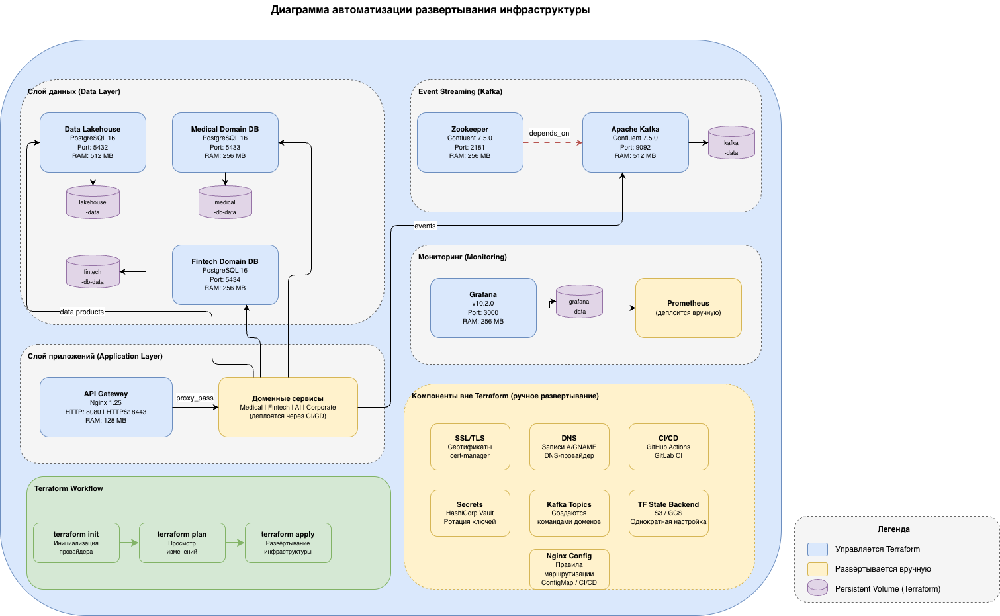

# Задание 4. Проектирование облачной инфраструктуры с применением IaaS и Terraform

## Диаграмма автоматизации развертывания



## Структура проекта

| Файл               | Описание                                                  |
| ------------------ | --------------------------------------------------------- |
| `main.tf`          | Описание инфраструктуры: сеть, volumes, контейнеры        |
| `variables.tf`     | Определение переменных с типами и значениями по умолчанию |
| `outputs.tf`       | Вывод ключевых параметров (эндпоинты, сводка)             |
| `terraform.tfvars` | Значения переменных для локального окружения              |
| `justification.md` | Обоснование выбора ресурсов и параметров                  |
| `diagram.drawio`   | Исходник диаграммы развертывания                          |
| `diagram.png`      | Диаграмма автоматизации развертывания                     |

## Требования

- [Terraform](https://developer.hashicorp.com/terraform/install) >= 1.5.0
- [Docker Desktop](https://www.docker.com/products/docker-desktop/) (запущен)

### Установка Terraform (macOS)

```bash
brew install terraform
```

## Запуск

```bash
cd task4
```

### 1. Инициализация

```bash
terraform init
```

### 2. Просмотр плана

```bash
terraform plan
```

### 3. Развертывание инфраструктуры

```bash
terraform apply
```

Terraform запросит подтверждение. Введите `yes` для применения. Для автоматического подтверждения:

```bash
terraform apply -auto-approve
```

### 4. Проверка результата

После успешного `apply` будут доступны:

| Компонент                   | URL / Endpoint          |
| --------------------------- | ----------------------- |
| Data Lakehouse (PostgreSQL) | `localhost:5432`        |
| Medical Domain DB           | `localhost:5433`        |
| Fintech Domain DB           | `localhost:5434`        |
| Apache Kafka                | `localhost:9092`        |
| Zookeeper                   | `localhost:2181`        |
| API Gateway (Nginx)         | `http://localhost:8080` |
| Grafana                     | `http://localhost:3000` |

Проверка запущенных контейнеров:

```bash
docker ps --filter "label=project=datamesh"
```

### 5. Удаление инфраструктуры

```bash
terraform destroy
```
